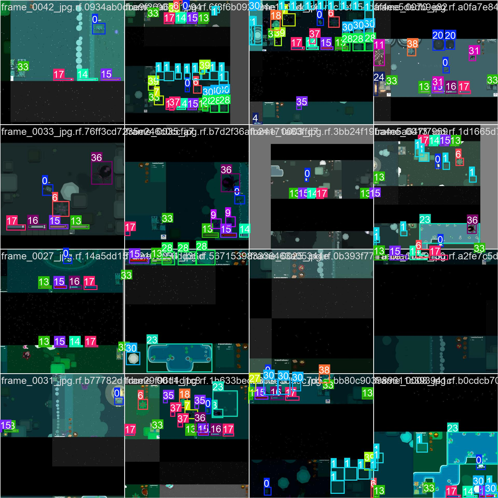
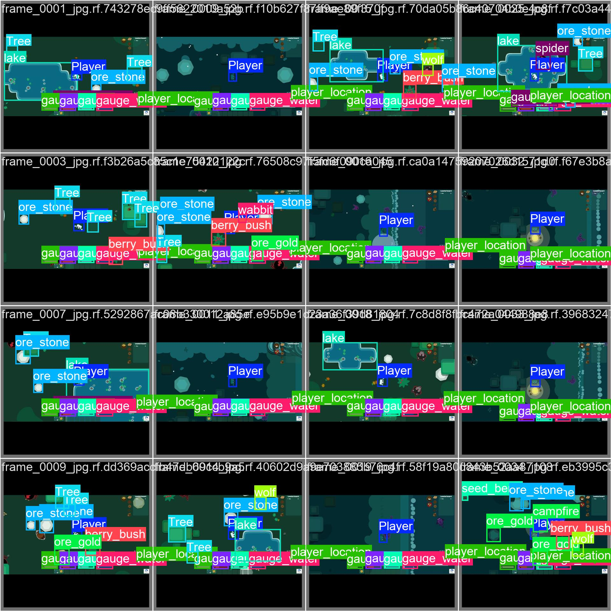
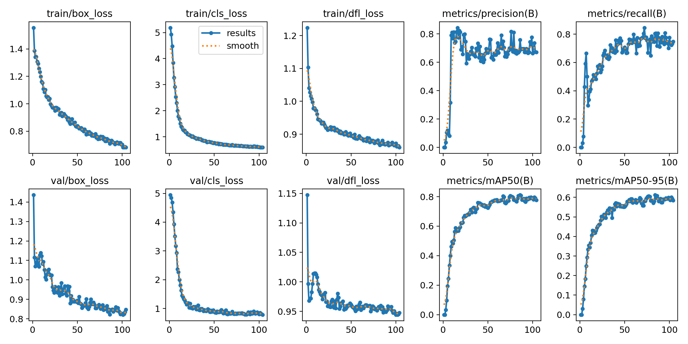

# 🧠 Game Vision AI

A computer-vision prototype using **Ultralytics YOLO** to detect on-screen objects in real-time gameplay environments.  
Originally developed for *Starve.io*, this project demonstrates how YOLO models can identify and track in-game entities through live screen capture.

---

## 📦 Tech & Dependencies

- Python 3.10+
- PyTorch (CPU or GPU)
- Ultralytics YOLO
- OpenCV (`opencv-python`)
- `mss` for fast screen capture
- `keyboard` for hotkeys (Windows/Linux; limited on macOS)
- `pyautogui` for optional automation (mouse/keyboard)
- `numpy`

> macOS note: the `keyboard` library has limited support. If it causes issues on macOS, consider alternatives (e.g., `pynput`) or run without hotkeys.  
> Performance note: Ensure your system has a **dedicated GPU**. CPU-only systems will still run but at lower FPS. Install the correct PyTorch build (GPU or CPU) as shown below.

---

## ⚙️ Installation

1) **Create & activate a virtual environment**
```bash
python -m venv .venv
# Windows:
.venv\Scripts\activate
# macOS/Linux:
source .venv/bin/activate
```

2) **Install PyTorch first**
- **GPU (example: CUDA 12.1 build)**
  ```bash
  pip install torch torchvision torchaudio --index-url https://download.pytorch.org/whl/cu121
  ```
- **CPU-only**
  ```bash
  pip install torch torchvision torchaudio --index-url https://download.pytorch.org/whl/cpu
  ```

3) **Install project requirements**
```bash
pip install -r requirements.txt
```

4) **Sanity check (optional)**
```bash
python tools/env_check.py
```

---

## ▶️ Usage

### Dataset Capture
Edit the `dataset_root` and `monitor` **inside `dataset_generator.py`** to match your machine. Then run:
```bash
python dataset_generator.py
```
Controls:
- **P** → capture one frame to `dataset/images/{train|val}` (80/20 split)  
- **F2** → quit

### Live Detection
Edit `model_path` and `monitor` at the top of **`ai_test_run.py`**. Then:
```bash
python ai_test_run.py
```
- Opens a resizable window (maintains aspect ratio with letterboxing)  
- **Q** or **ESC** to exit

---

## 🏋️ Training or a YOLOv8 Model

You can train your **own model** on a custom dataset, in this case the script was originally developed for Starve.io to detect in-game objects and items.

### 🔹 Train a Custom Model
If you’ve collected and labeled your own dataset:

1. Ensure your dataset folder looks like this:
   ```
   dataset/
   ├── images/
   │   ├── train/
   │   └── val/
   └── labels/
       ├── train/
       └── val/
   ```

2. Create a simple `data.yaml` file:
   ```yaml
   path: dataset
   train: images/train
   val: images/val
   names:
     0: pickaxe
     1: berry
     2: tree
   ```

3. Train the model:
   ```bash
   yolo detect train data=dataset/data.yaml model=yolov8n.pt epochs=50 imgsz=640
   ```

4. After training, weights will appear at:
   ```
   runs/detect/train/weights/best.pt
   ```

   Update your `ai_test_run.py`:
   ```python
   model_path = "runs/detect/train/weights/best.pt"
   ```

5. Resume training if needed:
   ```bash
   yolo detect train resume model=runs/detect/train/weights/last.pt
   ```

---

## 🧠 Model Weights

Weights are **not** committed due to size.  
Place your trained weights here:
```
runs/detect/train/weights/best.pt
```

---

## 🖼️ Examples

These sample images are copied from YOLO training outputs.

**Training Samples**  


**Validation Samples**  


**Training Summary**  


---

## 🧪 Troubleshooting

- **OpenCV window not resizing properly** → ensure `cv2.WINDOW_NORMAL` is used (already implemented).  
- **`keyboard` errors on macOS** → run with accessibility permissions or use `pynput`.  
- **CUDA not detected / slow inference** → verify correct PyTorch build:
  ```bash
  python -c "import torch; print('cuda available:', torch.cuda.is_available())"
  ```

---

## ✅ Verified Environment
- Python 3.12.4  
- torch 2.5.1+cu121 (CUDA available)  
- ultralytics 8.3.217  
- opencv-python 4.12.0  
- numpy 2.2.6  
- mss 10.1.0  
- keyboard / pyautogui functional on Windows  

---

## 📜 License

MIT
